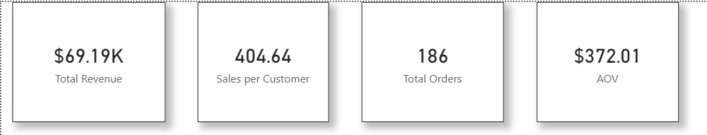
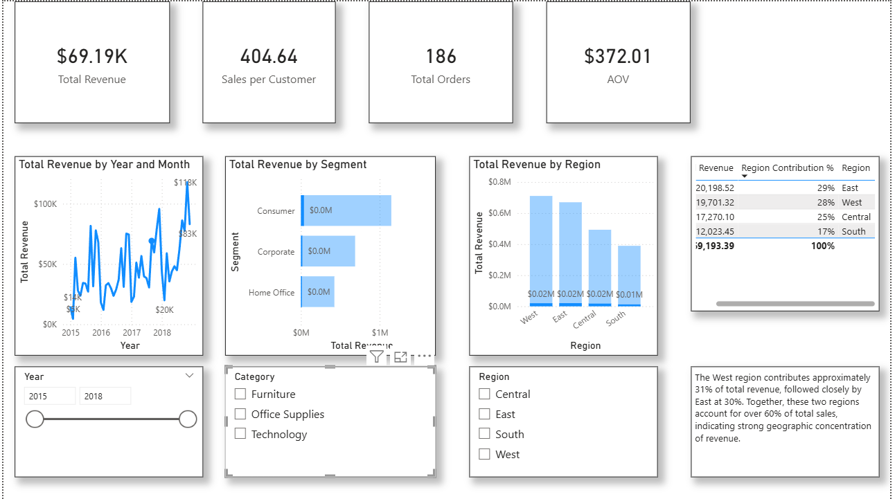
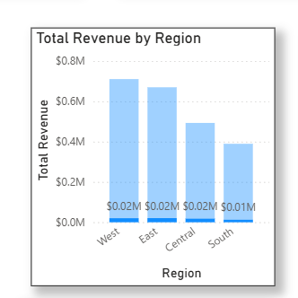
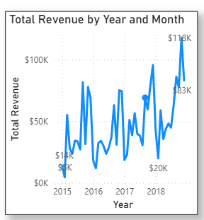

# Task3-DeepDive-Dashboard
# Superstore Sales Performance Dashboard (Power BI)

## Project Objective
Analyze sales performance across regions, segments, and time to identify revenue drivers and improvement opportunities.

## Dataset
Superstore dataset containing:
- Orders
- Sales
- Profit
- Region
- Customer Segment
- Order Date

## Key KPIs
- Total Revenue
- Total Profit
- Total Orders
- Region Contribution %
- Segment Contribution %
- Revenue Trend Over Time

## Key Insights
- West region contributes highest revenue (~31%)
- Consumer segment generates highest revenue ($11.48M)
- Revenue shows upward seasonal pattern in Q4
- Certain regions underperform despite high order volume

## Business Recommendations
- Increase marketing focus in high-margin regions
- Improve profitability in low-performing segments
- Leverage Q4 seasonal demand

## Dashboard Preview

### KPI Section

### Overview

### Region Analysis

### Revenue Trends

## Sample DAX Measures

Total Revenue = SUM(Orders[Sales])

Region Contribution % =
DIVIDE(
    [Total Revenue],
    CALCULATE([Total Revenue], ALL(Orders[Region]))
)

